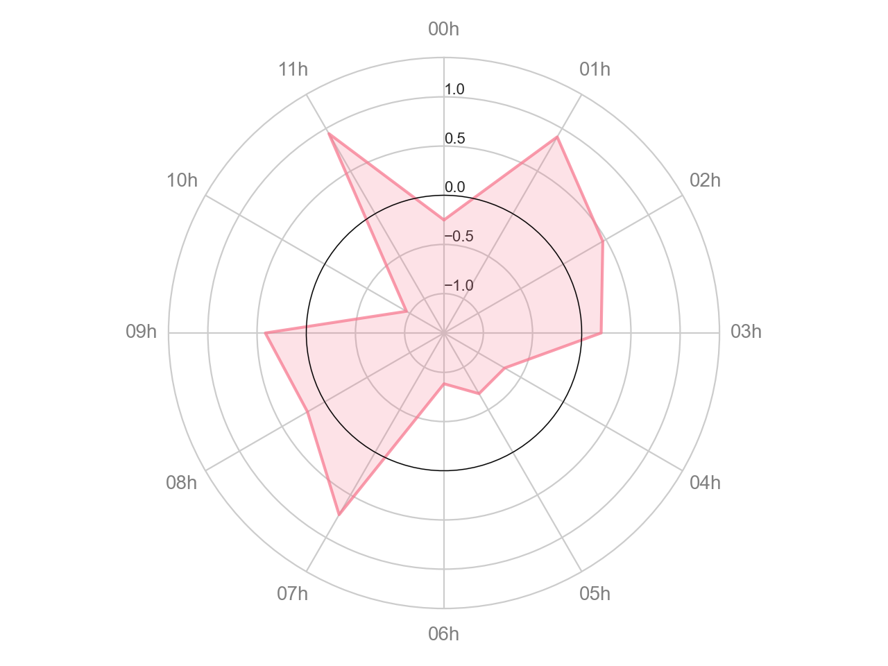
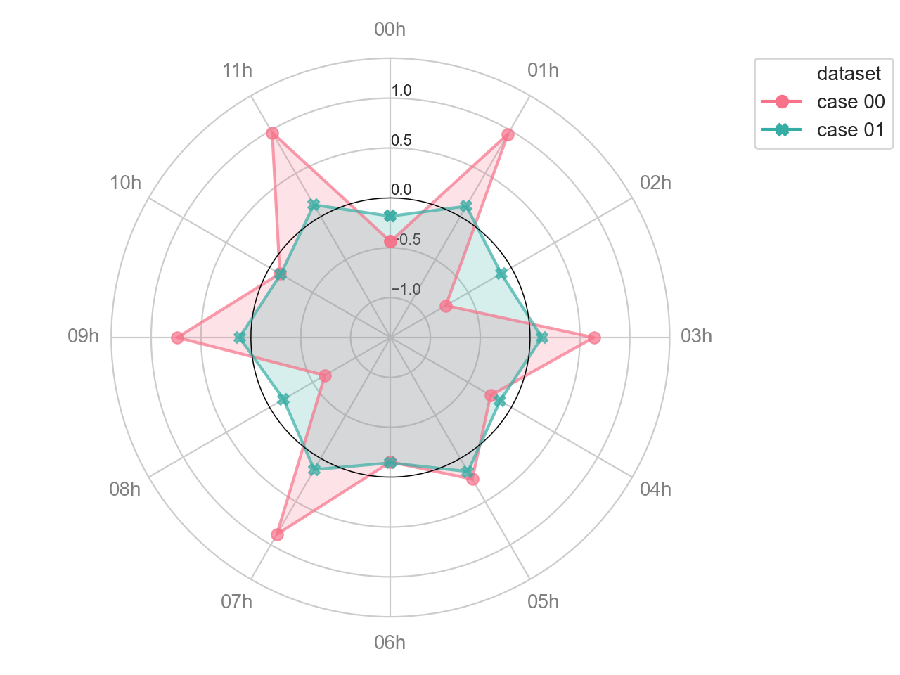
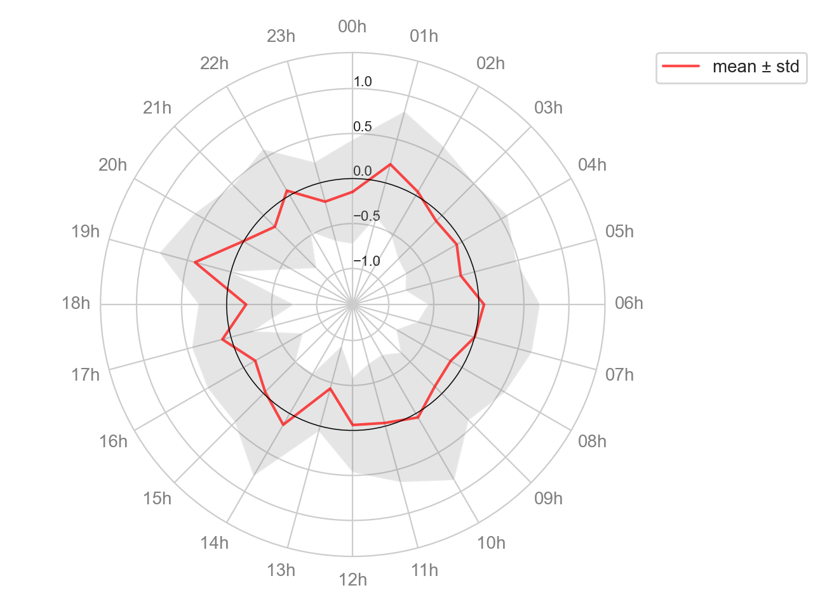

# spiderplot

Python package to create 2D spider charts.

The [spider chart](https://en.wikipedia.org/wiki/Radar_chart) is a type of relational graph y=f(x). The implementation is based on seaborn's [lineplot()](https://seaborn.pydata.org/generated/seaborn.lineplot.html) using a polar coordinate system.


## Installation

The package can be installed via pip:

```none
pip install spiderplot
```

Use the following commands for a quick verification of the installation.

```bash
python -c "import spiderplot; print(spiderplot.__version__)"
python -c "import spiderplot; spiderplot.demo_pair()"
```


## Usage


Similar to seaborn functions, spiderplot accepts different data formats:

- *array mode*: `spiderplot(x=x, y=y)`  
     with `x`, `y` (and other parameters) being sequences
- *long-form mode*: `spiderplot(x=x, y=y, ..., data=data)`  
     with `data` being a [DataFrame](https://pandas.pydata.org/docs/reference/api/pandas.DataFrame.html) and the other parameters (x, y, hue, size, extent) being keys of `data`
- *wide-form mode*: `spiderplot(data)`  
                  with `data` being a [DataFrame](https://pandas.pydata.org/docs/reference/api/pandas.DataFrame.html), using the following mapping:  
                  `x` are the row indices (`data.index`)  
                  `y` are the table values (`data.values`)
                  every column of `data` represents a different category of the plot.

See [this tutorial](https://seaborn.pydata.org/tutorial/data_structure.html) about data structures in seaborn for further details.

To print the help text of the function:

```python
import spiderplot as sp
help(sp.spiderplot)
help(sp.spiderplot_facet)
```

See the [examples](https://github.com/hirsch-lab/spider-chart/tree/main/examples) for further usage information. 

### Basic example

```python
import seaborn as sns
import spiderplot as sp
import matplotlib.pyplot as plt
sns.set_style("whitegrid")
# Load some demo data.
df = sp.demo.generate_data(mode="long-form", d=1)
# Create spider plot.
ax = sp.spiderplot(x="x", y="value", hue="dataset", legend=False,
                   data=df, palette="husl", rref=0)
# Adjust limits in radial direction.
ax.set_rlim([-1.4,1.4])
plt.show()
```

<p align="center">



### Multiple plots

```python
df = sp.demo.generate_data_pair(mode="long-form")
sns.set_style("whitegrid")
ax = sp.spiderplot(x="x", y="value", hue="dataset", style="dataset",
                   data=df, dashes=False, palette="husl", rref=0)
ax.set_rlim([-1.4,1.4])
ax.legend(loc="upper right",
           bbox_to_anchor=(1.4, 1.),
           borderaxespad=0.)
plt.tight_layout()
plt.show()
```

<p align="center">



### Data aggregation

```python
df = sp.demo.generate_data(mode="long-form", n=24, d=10)
means = df.groupby("x")["value"].mean()
stds = df.groupby("x")["value"].std()
sns.set_style("whitegrid")
ax = sp.spiderplot(y=means, extent=stds, color="red", fillcolor="gray",
                   fill=False, rref=0, label="mean ± std")
ax.set_rlim([-1.4,1.4])
ax.legend(loc="upper right",
           bbox_to_anchor=(1.4, 1.),
           borderaxespad=0.)
plt.tight_layout()
plt.show()
```

<p align="center">



## Requirements

```none
Python>=3.6
numpy
pandas>=0.22
matplotlib>=3.0
seaborn>=0.9
```


## Project setup

```bash
git clone https://github.com/hirsch-lab/spider-chart.git
cd spider-chart
pip install -r requirements.txt
# Run examples
./examples/run_all.py
# Build package
python setup.py sdist bdist_wheel
```
